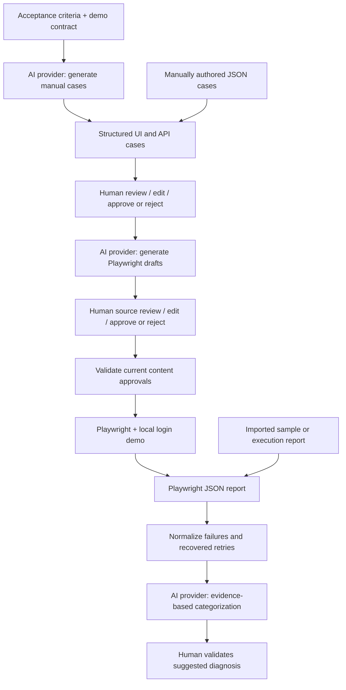

# AI-Assisted End-to-End Test Automation Workflow

A lightweight Senior AI QA Automation assessment prototype for the **User Login** feature. It turns acceptance criteria or manually authored tests into reviewable Playwright scripts, runs approved scripts against a local demo, and categorizes execution failures.

Scope follows [the supplied assessment](<Assessment -Sr AI QA Automation Testing,.md>). The interface is a CLI plus editable JSON and JavaScript files. There is no database, hosted application, agent framework, or advanced review UI.

## Run locally

Prerequisites: Node.js 22+ and npm. The checked-in lockfile pins dependencies. From this directory:

```powershell
npm.cmd ci
npx.cmd playwright install chromium
npm.cmd test
```

Commands use `npm.cmd` / `npx.cmd` for Windows PowerShell, where execution policy can block `npm.ps1`. On macOS/Linux, use `npm` / `npx`. Linux machines may need `npx playwright install --with-deps chromium`.

### 1. Generate and import manual cases

```powershell
npm.cmd run qa -- generate-cases --input examples/login-feature.json
npm.cmd run qa -- import-cases --input examples/manual-cases.json
npm.cmd run qa -- status
```

This creates `work/default/cases.json`: ten generated cases (five UI and five API) and two imported cases (one UI and one API). All begin **pending review**. Mock mode is the default and does not call an LLM.

Open `work/default/cases.json` in your editor. Check the requirement links, preconditions, steps, inputs, and expected results. Edit any case directly in that file. The `data` and `expected` fields are the executable login contract; make sure they agree with the readable steps.

### 2. Review the cases

After reviewing, replace `Your Name` with your name:

```powershell
npm.cmd run qa -- review-cases --ids all --decision approve --reviewer "Your Name" --note "Checked coverage and login expectations"
npm.cmd run qa -- generate-automation
```

To approve only selected cases, use `--ids UI-001,API-001`. To reject a case, use the same review command with `--decision reject` and an explanatory `--note`. Without `--ids`, automation generation selects only currently approved cases. An explicit selection containing an unapproved case is rejected.

### 3. Review the automation, then execute

Open `work/default/automation.json` to locate the generated `.spec.js` files. Inspect the source files: locators, assertions, credentials, API calls, and agreement with the approved steps. Edit the scripts in place as needed, then record the decision:

```powershell
npm.cmd run qa -- review-automation --ids all --decision approve --reviewer "Your Name" --note "Checked Playwright source against approved cases"
npm.cmd run qa -- run
npm.cmd run qa -- analyze --report work/default/execution-report.json
```

Playwright starts and stops the local login app automatically. The default URL is `http://127.0.0.1:4173`; that port must be free. Healthy demo behavior should yield **12 passing tests**. Analysis of an all-passing report returns an empty classification list without calling AI.

The review commands also support `--decision reject`. Editing a script invalidates its approval. Editing a case or feature contract invalidates case approval and its generated automation: re-review the case, regenerate the scripts, and review them again. Regeneration creates a fresh directory requiring a fresh script review. The runner blocks the entire current generation if any included script is pending, rejected, or stale; generate a smaller selection to exclude rejected scripts.

### 4. Demonstrate failure categorization

The supplied failure report is explicitly synthetic and covers all requested categories:

```powershell
npm.cmd run qa -- analyze --report examples/failure-report.json
```

Read `work/default/failure-categorization.json`. It includes evidence, tentative reasoning, confidence, a next investigation action, and a human-review flag. It also preserves whether an item is a final failure, interruption, report error, or recovered retry.

For a real failing execution, the demo can deliberately allow locked-account login:

```powershell
$env:DEMO_BUG = 'locked-login'
npm.cmd run qa -- run
Remove-Item Env:DEMO_BUG
npm.cmd run qa -- analyze --report work/default/execution-report.json
```

With all twelve sample tests approved, this run should have **10 passes and 2 failures** (`UI-005`, `API-005`). The run command deliberately returns a nonzero exit code when tests fail. The mock triager conservatively calls these assertion mismatches because the raw assertion errors alone do not prove the root cause. The synthetic product-defect example includes additional account-state and reproduction evidence. No category automatically changes a test or opens a defect.

Every run replaces the workspace's execution report, and every analysis replaces its categorization file. Copy outputs you want to retain. Use `--workspace work/interview` on **every command** to start a separate demonstration without overwriting an existing run. Case generation refuses to overwrite an existing case file.

## Manual input without AI generation

Manual input uses exactly the same case schema and approval path. It can also initialize a fresh workspace:

```powershell
npm.cmd run qa -- import-cases --workspace work/manual-only --input examples/manual-cases.json --feature examples/login-feature.json
```

Continue the review/generate/review/run commands with `--workspace work/manual-only`. Imports append cases and reject duplicate IDs, invalid types, missing fields, and unknown requirement references. To change an existing case, edit `cases.json` rather than importing the same ID again.

Each case has:

| Field | Meaning |
| --- | --- |
| `id`, `type`, `title` | Stable `UI-NNN` / `API-NNN` ID, coverage type, human-readable intent |
| `requirementIds` | Links to acceptance criteria |
| `preconditions`, `steps` | Readable ordered manual execution instructions |
| `data` | Login username and password, including empty strings for mandatory-field tests |
| `expected` | HTTP status and response/visible message |

For UI cases, the expected status documents the backing API contract; the generated UI script asserts the visible message. API scripts assert both status and JSON response. See [manual input examples](examples/manual-cases.json) and [schemas](src/schemas.js).

## Architecture and design decisions



- **Small Node.js modules:** [CLI](src/cli.js) handles commands; [workflow](src/workflow.js) owns state and gates; [provider](src/provider.js) separates model access; [report parser](src/reports.js) normalizes results. Only Playwright and Ajv are dependencies.
- **Structured model output:** JSON schemas validate generation, manual imports, and classifications. Semantic checks enforce distinct IDs, valid requirement links, UI/API coverage, and exactly one returned script/classification per requested case/failure. Syntax checks run before script approval. Schema validity does not establish test correctness.
- **Review bound to content:** SHA-256 digests associate reviews with the current feature, case, and script contents. Decisions record reviewer, timestamp, and note in `reviews.json`, with prior decisions retained in history. Each generation has a separate manifest so old or unselected scripts are not discovered accidentally.
- **Repeatable execution:** Playwright uses one Chromium worker, no retries by default, isolated tests, accessible locators, and web-first UI assertions. The runner controls the local server and saves JSON plus failure traces/screenshots.
- **Report handling:** Recursively processes nested suites, projects, attempts, expected failures, unexpected passes, skipped tests, interruptions, and report-level errors. A retry that recovers is counted as flaky rather than as a final failure. The `passed` count includes expected failures behaving as declared by an imported report.
- **Triage remains tentative:** A status/text mismatch is not sufficient proof of a product defect. `Needs investigation` avoids forcing unsupported diagnoses. Confidence is a model/rule estimate, not a calibrated probability.

## How AI is used

The same provider interface covers three steps:

| Stage | Context | Output | Prompt |
| --- | --- | --- | --- |
| Manual generation | Acceptance criteria and explicit demo contract | Structured UI/API test cases | [generate-cases](prompts/generate-cases.txt) |
| Automation generation | Selected, currently approved cases and contract | Playwright source per case | [generate-automation](prompts/generate-automation.txt) |
| Failure categorization | Normalized errors, retry outcome, available case/feature context | Category, confidence, evidence, reasoning, next action | [classify-failures](prompts/classify-failures.txt) |

Prompt text is separate from input data. Successful schema-valid exchanges are saved under `work/<name>/ai-audit/` with provider/model, prompts, output, timestamp, and an explicit `mocked` flag. Invalid responses fail the command; they are not approved or silently substituted with mock output. Only textual failure evidence is sent for triage; screenshots and traces remain local.

### Mock mode (fully runnable offline after dependency/browser installation)

`--provider mock` uses deterministic fixtures and templates, **not live AI inference**:

- Case generation recognizes only the supplied feature input and creates the ten documented demo cases. Changed criteria fail with guidance to use a live provider or manual input.
- Automation generation uses a scoped login template driven by each approved case's type, data, expected values, and the feature contract. It supports imported cases using that same contract; it does not interpret arbitrary natural-language workflows.
- Failure categorization uses transparent keyword/evidence rules in [mock-provider.js](src/mock-provider.js). This simulates the LLM contract for an interview demonstration; it is not an AI classifier evaluation.

### Live AI mode (Ollama)

Install and start Ollama separately and pull a model supported by your machine. Set its exact installed model name; no model download is performed by this project:

```powershell
$env:OLLAMA_MODEL = 'your-installed-model-name'
$env:OLLAMA_URL = 'http://127.0.0.1:11434'
npm.cmd run qa -- generate-cases --workspace work/live --input examples/login-feature.json --provider ollama
```

After reviewing the resulting cases, run `generate-automation --workspace work/live --provider ollama`, review the source, then execute. To classify the supplied report with the model:

```powershell
npm.cmd run qa -- analyze --workspace work/live --report examples/failure-report.json --provider ollama
```

The adapter calls `/api/chat` with `stream: false`, temperature `0`, and the output JSON schema in `format`. The request timeout is three minutes. An unavailable model, invalid JSON, missing coverage, or invalid schema fails explicitly. There is no silent fallback. Different models may require prompt refinement and human edits.

**Validation boundary:** mock mode and real Playwright execution were exercised for the supplied sample. The Ollama request/response adapter is covered with simulated HTTP responses; no local Ollama model was available for live inference validation. The included sample artifacts are marked accordingly.

## Implemented versus mocked

| Capability | Implementation |
| --- | --- |
| Input, validation, import, review/edit/reject/approve gates | Real CLI and files |
| LLM connection | Implemented Ollama HTTP adapter; live model run not verified |
| Default AI results | Explicit deterministic mock provider |
| UI/API execution | Real Playwright against the local demo app |
| Pharmaceutical application integration | None; local User Login fixture substitutes for an external application |
| Authentication | Demo credential checks and visible result only; no sessions, identity provider, or production authentication |
| Report parsing and categorization output | Real parser and workflow; default diagnostic reasoning is mocked |
| All-category failure report | Explicit hand-authored synthetic fixture |
| Passing and injected-defect reports | Real local Playwright executions; defect is deliberately injected |

## Sample outputs and deliverables

See [samples/README.md](samples/README.md) for artifact provenance and verification results.

| Assessment deliverable | Location |
| --- | --- |
| Complete source and local run instructions | This repository and README |
| Generated/manual cases | `samples/generated-test-cases.json`, `samples/reviewed-test-cases.json`, `examples/manual-cases.json` |
| Generated Playwright scripts | `samples/playwright/*.spec.js` |
| Execution results | `samples/execution-pass.json`, `samples/execution-fail.json`, `examples/failure-report.json` |
| Failure categorization | `samples/failure-categorization.json`, `samples/real-failure-categorization.json` |
| Prompts and workflow | `prompts/`, this README |
| Scaling, human validation, future improvements | [Design note](docs/design-note.md) |
| Requirement-to-implementation mapping | [Coverage map](docs/assessment-coverage.md) |

The `samples` scripts are reviewable copies, not automatically executable approvals. Reproduce the workflow to create a current review manifest. Runtime outputs, dependencies, local environment files, and browser binaries are excluded from the submission ZIP.

## Assumptions and limitations

- “Appropriate status codes” is underspecified in the assessment. This demo explicitly assumes **200** success, **401** invalid credentials, **400** mandatory fields, and **423** locked account. Message wording, selectors, and account data are also demo assumptions, captured in `examples/login-feature.json`.
- Only one login form and one JSON POST endpoint are supported by the mock automation adapter. Manual input is structured JSON, not PDF/Excel ingestion. Reports must use the Playwright JSON reporter format; HTML/JUnit import is not implemented.
- A success message represents successful login for this prototype. Session creation, authorization, rate limiting, MFA, and regulatory validation are outside the supplied scope.
- Both fields are tested individually and together as empty strings. Exhaustive equivalence classes, malformed payloads, accessibility, performance, and cross-browser coverage are not claimed.
- Review records are local workflow controls, not authenticated approvals or tamper-proof audit records. A user can edit local metadata or invoke Playwright directly. Generated JavaScript runs with normal local Node privileges after review; this prototype has no code sandbox.
- Model output may be incomplete or wrong despite passing validation. The reviewer must check requirement interpretation, executable data versus readable steps, and script behavior. Triage may lack context and cannot prove a root cause.
- Demo credentials are public fixtures. Audit files retain input and output; use sanitized demo inputs rather than private application data.
- Each workspace is single-writer. Workspaces must be below this project's `work/` directory so generated ESM scripts can resolve project dependencies. The server uses a fixed local port unless `DEMO_PORT` is set.

## Technical references

Implementation follows the official [Playwright JSON reporter documentation](https://playwright.dev/docs/test-reporters#json-reporter), [Playwright web server configuration](https://playwright.dev/docs/test-webserver), [Ollama chat API](https://docs.ollama.com/api/chat), and [Ollama structured output documentation](https://docs.ollama.com/capabilities/structured-outputs).
